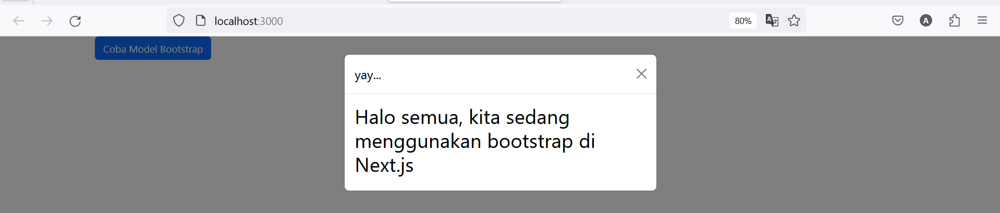

This is a [Next.js](https://nextjs.org/) project bootstrapped with [`create-next-app`](https://github.com/vercel/next.js/tree/canary/packages/create-next-app).

## Getting Started

First, run the development server:

```bash
npm run dev
# or
yarn dev
# or
pnpm dev
# or
bun dev
```

Open [http://localhost:3000](http://localhost:3000) with your browser to see the result.

You can start editing the page by modifying `app/page.tsx`. The page auto-updates as you edit the file.

This project uses [`next/font`](https://nextjs.org/docs/basic-features/font-optimization) to automatically optimize and load Inter, a custom Google Font.

## Laporan Praktikum

|  | Pemrograman Berbasis Framework 2024 |
|--|--|
| NIM |  2141720237|
| Nama |  Alvaro Hegel Ivanka |
| Kelas | TI - 3A |


### Praktikum 1



menampilkan button yang ketika diklik menampilkan pop up

### Praktikum 2


menampilkan tampilan login dan log out

### pertanyaan 2

Baris 25 dan 30 terdapat method parse(), apa yang terjadi jika kita tidak menggunakan method tersebut?

### Jawaban 2
maka tidak muncul output login dan log out

### Praktikum 3


menampilkan button untuk menambah dan mengurangi counter